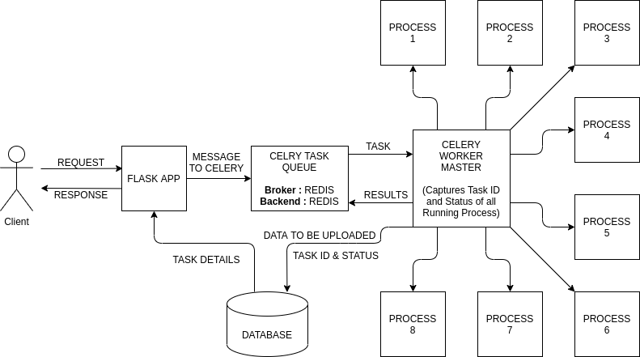

# Atlan-collect
A Flask web app that runs several long running tasks parellelly and provides the options to **Pause, Resume** and **Cancel** those tasks at any point of time.

<br/>

### Technology Stack
1) Flask
2) Celery with Redis as broker and backend
3) Sqlite
4) Docker & Dockor Compose

### How it works ?


<br/>

### Local Setup
- Clone this repository on your system by running :
```
git clone https://github.com/shubhamkumar27/Atlan-collect.git
```

- Make sure you have installed **Docker** on your system. If not visit [here](https://docs.docker.com/get-docker/).

- Run the commands mentioned below to build and run Docker container
```
$ sudo docker-compose build
$ sudo docker-compose up
```

- If all three services : web, redis and worker starts properly then go to : http://0.0.0.0:5000/


<br/>

### APIs working behind the app
1) GET  -  `/upload?channel={online/offline}`

 >This will upload the data from our CSV file to our database according to our channel request (online or offline).

**Note** :  This API can be converted into POST request, if the option to choose a file is given. Currenly I am only using the file already kept inside app/resources.


2) GET  -  `/pause?id={task_id}`

 >This will pause the the task with the mentioned task_id.

3) GET  -  `/resume?id={task_id}`

 >This will resume the the task with the mentioned task_id.

4) GET  -  `/cancel?id={task_id}`

 >This will terminate/cancel the the task with the mentioned task_id.

5) GET  -  `/data`

 >This will return the JSON data with all the details of last 10 tasks performed.

6) GET  -  `/alltasks`

 >This will return the JSON data with all the details of completed/cancelled tasks.


<br/>

### Bootstrap theme used
- Theme name : Clean Blog
- Created by : https://startbootstrap.com
- Theme url  : https://startbootstrap.com/themes/clean-blog/


